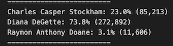

# Election_Analysis

# Overview
A Colorado Board of Elections employee has given tasks to complete the election audit of a recent local congressional election and provided with CSV file.
# Election-Audit Results: 
-	Total number of votes cast
 
-	Number and percentage of votes for each candidate and winning candidate based on popular vote

 
-	The voter turnout for each county and percentage of votes from each county out of the total count
 
-	The county with the highest turnout
 

# Election-Audit Summary
This Python script can be used for any elections for above analysis as well as other analysis with some modifications. For example, we can also find out which county has the lowest turnout and the candidate who received lowest votes.

